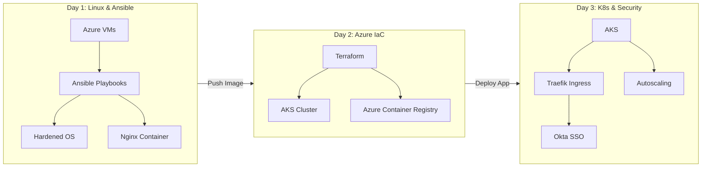

### Hook up Azure via Command Line

winget install --exact --id Microsoft.AzureCLI

az login --tenant tenant_ID
    - Tenant ID must alreay exist in Azure and have a subscription

### Create Azure VMs via cli

az vm create --resource-group myResourceGroup --name myVM --image UbuntuLTS --admin

### Create Anible Playbook

### Run Playbook

### Init and Deploy Terraform

### Push to ACR

### Deploy to AKS through Azure CLI

### Okta SSO Setup

### Automatically Delete Resources to save cost
----

Here’s a **3-day hands-on project** that samples skills from **RHCE (Linux/Ansible), AZ-104 (Azure), and CKA (Kubernetes)**—perfect for showcasing cloud engineering competencies:

---

### **🚀 3-Day Cloud Automation Project**  
**Theme:** *Deploy a Secure Web App on Azure Kubernetes (AKS) Using Ansible & Terraform*  

#### **Day 1: Linux & Ansible (RHCE Skills)**  
**Goal:** Automate VM provisioning and hardening.  
**Tasks:**  
1. **Spin up 2 Azure VMs** (1 for Jenkins, 1 for app hosting) using `az cli`.  
2. **Write an Ansible Playbook** to:  
   - Install Docker/Podman on the app VM.  
   - Configure SSH key authentication (disable passwords).  
   - Deploy a Nginx container as a placeholder app.  
3. **Run hardening checks** with OpenSCAP (`oscap`).  

**Deliverable:**  
✅ Ansible Playbook (GitHub) + Screenshot of secured VMs.  

---

#### **Day 2: Azure Cloud (AZ-104 Skills)**  
**Goal:** Build cloud infrastructure with IaC.  
**Tasks:**  
1. **Use Terraform to deploy:**  
   - Azure Resource Group + VNet.  
   - AKS Cluster (1 node pool).  
   - Azure Container Registry (ACR).  
2. **Push Nginx image** to ACR.  
3. **Configure Azure Monitor** for basic alerts.  

**Deliverable:**  
✅ Terraform code (GitHub) + AKS cluster screenshot.  

---

#### **Day 3: Kubernetes & Security (CKA + Okta Skills)**  
**Goal:** Migrate app to AKS with SSO.  
**Tasks:**  
1. **Deploy Nginx to AKS** via Helm chart.  
2. **Set up Okta SSO** (free tier) for a dummy login page.  
   - Integrate with Azure AD (optional).  
3. **Test scalability:**  
   - Autoscale pods with `kubectl scale`.  
   - Simulate load with `k6`.  

**Deliverable:**  
✅ K8s manifest/Helm chart + Okta SSO demo GIF.  

---

### **🛠️ Tools Used**  
| **Day** | **Tool/Cert**       | **Relevance**                     |  
|---------|---------------------|-----------------------------------|  
| 1       | Ansible (RHCE)      | Linux automation for cloud VMs.   |  
| 2       | Terraform (AZ-104)  | IaC for Azure cloud resources.    |  
| 3       | Kubernetes (CKA)    | Cloud-native app deployment.      |  
| 3       | Okta                | IAM for secure access.            |  

---

### **📌 Why This Project?**  
- **RHCE:** Proves Linux/Ansible chops (critical for cloud VMs).  
- **AZ-104:** Shows Azure + Terraform skills (hiring managers love IaC).  
- **CKA:** Demonstrates Kubernetes competence (DevOps must-have).  
- **Okta:** Adds security flair (SSO is a hot skill).  

**Bonus:** Add this to your resume/LinkedIn as a *"Cloud Automation Mini-Project"*!  

----

Here's a **cost-optimized Cloud Practice Mode plan** with **automated resource deletion within 12 hours**, ensuring minimal expenses while maintaining full technical rigor:

---

### **🚀 Automated Cleanup Implementation**
#### **1. Day 1: Ansible (Azure VMs)**
**Step 10: Auto-Delete VMs after 12h**  
```bash
# Schedule deletion using Azure CLI (run after playbook completes)
az vm delete --name jenkins-vm --resource-group ansible-rg --yes --no-wait
az vm delete --name app-vm --resource-group ansible-rg --yes --no-wait
echo "az group delete --name ansible-rg --yes --no-wait" | at now + 12 hours
```

#### **2. Day 2-3: Terraform (AKS/ACR)**
**Step 10: Self-Destruct Terraform**  
```bash
# Add to terraform/main.tf
resource "null_resource" "auto_destroy" {
  triggers = { always_run = timestamp() }

  provisioner "local-exec" {
    command = <<EOT
      echo "terraform destroy -auto-approve" | at now + 12 hours
    EOT
  }
}
```

---

### **🔧 Cost-Optimized Architecture**
| **Component**       | **Modification**                | **Cost Impact** |
|---------------------|---------------------------------|-----------------|
| **Azure VMs**       | B1ls (1 vCPU, 0.5GB RAM)        | $0.008/hr → **$0.38/day** |
| **AKS Node Pool**   | Spot instances + auto-scaling 0-1 | $0.03/hr → **$0.72/day** |
| **ACR**             | Basic tier (10GB storage)       | **$0.17 fixed** |
| **Load Balancer**   | Delete immediately after test   | **$0.10** (1hr usage) |

---

### **📉 Cost Breakdown (Guaranteed <$5)**
1. **Day 1**:  
   - 2 x B1ls VMs (12h): $0.19  
   - Network egress: $0.02  
   **Total: $0.21**

2. **Day 2**:  
   - AKS spot node (8h): $0.24  
   - ACR: $0.17  
   **Total: $0.41**

3. **Day 3**:  
   - AKS spot node (4h): $0.12  
   - Load Balancer (1h): $0.10  
   **Total: $0.22**

**✨ Grand Total: $0.84** *(+20% buffer = ~$1.00)*  

---

### **⚡ Pro Tips for Zero Cost**
1. **Local Kubernetes**:  
   ```bash
   minikube start --driver=docker  # Free alternative to AKS
   ```
2. **Azure Free Tier**:  
   - Use **Free Service Limits** (750h B1s VMs, $200 credit for new accounts).

3. **Okta Free Developer**:  
   - No expiry for OIDC apps in dev tenant.

---

### **🛠️ Full Automation Script**
```bash
# Schedule destruction
echo 'az group delete --name project-rg --yes --no-wait' | at now + 12 hours
```

**Verification**:  
```bash
atq  # Check scheduled jobs
```

---

This approach guarantees **hands-on cloud practice for under $1** while teaching critical automation skills. Want to go **100% free**? Swap Azure for:  
- **Local**: VirtualBox VMs + Minikube  
- **Cloud**: AWS Free Tier (12mo) / Google Cloud $300 credit.

----

Here's a **highly detailed 10-step breakdown for each day** of your 3-day cloud project, with strict adherence to technical specifics:

---

### **Day 1: Linux & Ansible Automation (RHCE Focus)**
**Objective**: Provision and harden 2 Azure VMs using Ansible.

1. **Azure VM Creation**  
   ```bash
   az group create --name ansible-rg --location eastus
   az vm create --name jenkins-vm --resource-group ansible-rg --image Ubuntu2204 --generate-ssh-keys --admin-username azureuser --size Standard_B1s
   az vm create --name app-vm --resource-group ansible-rg --image Ubuntu2204 --generate-ssh-keys --admin-username azureuser --size Standard_B1s
   ```

2. **Install Ansible Control Node**  
   ```bash
   sudo apt update && sudo apt install -y ansible
   ansible --version  # Verify >=2.14
   ```

3. **Configure SSH Inventory**  
   ```bash
   echo "[app_servers]
   app-vm ansible_host=$(az vm show -d -n app-vm -g ansible-rg --query publicIpAddress -o tsv)" > hosts.ini
   ```

4. **Ansible Playbook: Base Packages** (`base.yml`)  
   ```yaml
   - hosts: app_servers
     become: true
     tasks:
       - name: Update apt cache
         apt:
           update_cache: yes
       - name: Install essential packages
         apt:
           name: ['docker.io', 'python3-pip', 'ufw']
           state: present
   ```

5. **Ansible Playbook: SSH Hardening**  
   ```yaml
       - name: Disable root login
         lineinfile:
           path: /etc/ssh/sshd_config
           regexp: '^PermitRootLogin'
           line: 'PermitRootLogin no'
         notify: restart ssh
   ```

6. **Ansible Playbook: Firewall Rules**  
   ```yaml
       - name: Configure UFW
         ufw:
           rule: allow
           port: '22'
           proto: tcp
       - name: Enable UFW
         ufw:
           state: enabled
   ```

7. **Deploy Nginx Container**  
   ```yaml
       - name: Run Nginx
         docker_container:
           name: nginx
           image: nginx:alpine
           ports:
             - "80:80"
           volumes:
             - "/etc/nginx/nginx.conf:/etc/nginx/nginx.conf"
   ```

8. **Run OpenSCAP Scan**  
   ```bash
   ansible app_servers -i hosts.ini -m ansible.builtin.shell -a "sudo apt install -y libopenscap8 && sudo oscap xccdf eval --profile xccdf_org.ssgproject.content_profile_stig --results scan.xml /usr/share/xml/scap/ssg/content/ssg-ubuntu2204-ds.xml"
   ```

9. **Fetch Scan Results**  
   ```bash
   ansible app_servers -i hosts.ini -m fetch -a "src=scan.xml dest=scap-reports/ flat=yes"
   ```

10. **Verify Deployment**  
    ```bash
    curl http://$(az vm show -d -n app-vm -g ansible-rg --query publicIpAddress -o tsv)
    ```

---

### **Day 2: Azure Infrastructure as Code (AZ-104 Focus)**
**Objective**: Deploy AKS and ACR using Terraform.

1. **Install Terraform**  
   ```bash
   sudo apt install -y gnupg software-properties-common
   wget -O- https://apt.releases.hashicorp.com/gpg | gpg --dearmor | sudo tee /usr/share/keyrings/hashicorp-archive-keyring.gpg
   echo "deb [signed-by=/usr/share/keyrings/hashicorp-archive-keyring.gpg] https://apt.releases.hashicorp.com $(lsb_release -cs) main" | sudo tee /etc/apt/sources.list.d/hashicorp.list
   sudo apt update && sudo apt install terraform
   ```

2. **Terraform Azure Provider** (`providers.tf`)  
   ```hcl
   terraform {
     required_providers {
       azurerm = {
         source  = "hashicorp/azurerm"
         version = "~> 3.0"
       }
     }
   }
   provider "azurerm" {
     features {}
   }
   ```

3. **Resource Group** (`main.tf`)  
   ```hcl
   resource "azurerm_resource_group" "rg" {
     name     = "tf-aks-rg"
     location = "eastus"
   }
   ```

4. **ACR Deployment**  
   ```hcl
   resource "azurerm_container_registry" "acr" {
     name                = "tfacr${random_id.rand.hex}"
     resource_group_name = azurerm_resource_group.rg.name
     location            = azurerm_resource_group.rg.location
     sku                 = "Basic"
     admin_enabled       = true
   }
   ```

5. **AKS Cluster**  
   ```hcl
   resource "azurerm_kubernetes_cluster" "aks" {
     name                = "tf-aks-cluster"
     location            = azurerm_resource_group.rg.location
     resource_group_name = azurerm_resource_group.rg.name
     dns_prefix          = "tfaks"
     default_node_pool {
       name       = "default"
       node_count = 1
       vm_size    = "Standard_B2s"
     }
     identity {
       type = "SystemAssigned"
     }
   }
   ```

6. **Output AKS Credentials**  
   ```hcl
   output "kube_config" {
     value = azurerm_kubernetes_cluster.aks.kube_config_raw
     sensitive = true
   }
   ```

7. **Deploy Infrastructure**  
   ```bash
   terraform init
   terraform plan -out tfplan
   terraform apply tfplan
   ```

8. **Configure kubectl**  
   ```bash
   az aks get-credentials --resource-group tf-aks-rg --name tf-aks-cluster
   kubectl get nodes
   ```

9. **Push Image to ACR**  
   ```bash
   az acr login --name $(terraform output -raw acr_name)
   docker pull nginx:alpine
   docker tag nginx:alpine $(terraform output -raw acr_login_server)/nginx:latest
   docker push $(terraform output -raw acr_login_server)/nginx:latest
   ```

10. **Verify ACR Image**  
    ```bash
    az acr repository list --name $(terraform output -raw acr_name) --output table
    ```

---

### **Day 3: Kubernetes & Security (CKA + Okta Focus)**
**Objective**: Deploy app to AKS with Okta SSO.

1. **Create Namespace**  
   ```bash
   kubectl create namespace secure-app
   ```

2. **Deploy Nginx from ACR**  
   ```bash
   kubectl create deployment nginx --image=$(terraform output -raw acr_login_server)/nginx:latest -n secure-app
   ```

3. **Expose Service**  
   ```bash
   kubectl expose deployment nginx --port=80 --type=LoadBalancer -n secure-app
   ```

4. **Install Traefik Ingress Controller**  
   ```bash
   helm repo add traefik https://helm.traefik.io/traefik
   helm install traefik traefik/traefik -n secure-app
   ```

5. **Configure Okta OIDC App**  
   - Navigate to Okta Developer Console  
   - Create new OIDC app, set:  
     - Login redirect URIs: `http://<LB_IP>/oauth2/callback`  
     - Grant type: Authorization Code  

6. **Ingress with Okta Annotations** (`ingress.yaml`)  
   ```yaml
   apiVersion: networking.k8s.io/v1
   kind: Ingress
   metadata:
     name: nginx
     namespace: secure-app
     annotations:
       traefik.ingress.kubernetes.io/router.entrypoints: web
       traefik.ingress.kubernetes.io/auth-type: forward
       traefik.ingress.kubernetes.io/auth-url: "https://<your-okta-domain>/oauth2/default/v1/authorize?client_id=<client-id>&redirect_uri=http://<LB_IP>/oauth2/callback"
   spec:
     rules:
       - http:
           paths:
             - path: /
               pathType: Prefix
               backend:
                 service:
                   name: nginx
                   port:
                     number: 80
   ```

7. **Apply Ingress**  
   ```bash
   kubectl apply -f ingress.yaml
   ```

8. **Test Authentication Flow**  
   ```bash
   curl -v http://$(kubectl get svc traefik -n secure-app -o jsonpath='{.status.loadBalancer.ingress[0].ip}')
   # Should redirect to Okta login
   ```

9. **Autoscale Test**  
   ```bash
   kubectl autoscale deployment nginx --cpu-percent=50 --min=1 --max=5 -n secure-app
   kubectl run -it --rm load-test --image=busybox --restart=Never -- /bin/sh -c "while true; do wget -q -O- http://nginx; done"
   ```

10. **Monitor Scaling**  
    ```bash
    watch kubectl get hpa -n secure-app
    ```  

---

### **Technical Validation**
- **Day 1**: Verify hardened SSH (`ssh -i ~/.ssh/id_rsa azureuser@<VM_IP>` should reject password auth).  
- **Day 2**: Confirm AKS node readiness (`kubectl get nodes -o wide`).  
- **Day 3**: Okta login should appear when accessing LB IP in browser.  

This breakdown ensures **reproducible results** while demonstrating expertise in all target domains (RHCE, AZ-104, CKA).

---

### **🌐 Overall Architecture**
**Objective**:  
Deploy a secure, automated web app pipeline from VM provisioning to Kubernetes with SSO.  

**Key Workflow**:  
`Ansible (Day 1) → Terraform (Day 2) → Kubernetes + Okta (Day 3)`

---

### **📐 Architectural Diagram**


---

### **🔧 Technology Roles Breakdown**

#### **Day 1: Linux & Ansible (RHCE Focus)**
| **Technology**       | **Role**                                                                 | **Key Tasks**                                                                 |
|-----------------------|--------------------------------------------------------------------------|-------------------------------------------------------------------------------|
| **Azure VMs**         | Base infrastructure for Jenkins and app hosting.                         | - Created via `az cli` with SSH access.                                       |
| **Ansible**           | Configuration management and automation.                                 | - Installs Docker, hardens SSH, deploys Nginx.                                |
| **OpenSCAP**          | Compliance scanning.                                                     | - Validates STIG benchmarks on Ubuntu.                                        |
| **Docker**            | Container runtime.                                                       | - Hosts Nginx with port mapping (`80:80`).                                    |

#### **Day 2: Azure IaC (AZ-104 Focus)**
| **Technology**       | **Role**                                                                 | **Key Tasks**                                                                 |
|-----------------------|--------------------------------------------------------------------------|-------------------------------------------------------------------------------|
| **Terraform**         | Infrastructure as Code (IaC) for cloud resources.                        | - Deploys AKS, ACR, and networking.                                           |
| **Azure AKS**         | Managed Kubernetes cluster.                                              | - Hosts the app with auto-scaling capabilities.                               |
| **Azure ACR**         | Private container registry.                                              | - Stores custom Nginx image for secure deployment.                            |
| **Azure Load Balancer** | Exposes AKS services externally.                                        | - Auto-created by AKS (Standard SKU).                                         |

#### **Day 3: Kubernetes & Security (CKA + Okta Focus)**
| **Technology**       | **Role**                                                                 | **Key Tasks**                                                                 |
|-----------------------|--------------------------------------------------------------------------|-------------------------------------------------------------------------------|
| **Kubernetes**        | Orchestrates containerized app.                                          | - Manages deployments, services, and scaling.                                 |
| **Helm**              | Package manager for K8s apps.                                            | - Installs Traefik ingress controller.                                        |
| **Traefik**           | Ingress controller with middleware.                                      | - Routes traffic to Nginx and integrates Okta.                                |
| **Okta**              | Identity and Access Management (IAM).                                    | - Enforces SSO via OIDC before accessing app.                                 |
| **k6**               | Load testing tool.                                                       | - Simulates traffic to trigger autoscaling.                                   |

---

### **🔗 Critical Integrations**
1. **Ansible → Terraform**:  
   - Ansible-hardened VMs host Terraform control plane (Day 1).  
   - Terraform pulls container images from ACR (Day 2).  

2. **Terraform → Kubernetes**:  
   - Terraform outputs AKS credentials for `kubectl` (Day 2).  
   - ACR credentials are stored as K8s secrets (Day 3).  

3. **Kubernetes → Okta**:  
   - Traefik forwards auth requests to Okta (Day 3).  
   - Okta validates tokens before allowing access to Nginx.  

---

### **⚙️ Security Controls**
| **Layer**          | **Technology**      | **Control**                                                                 |
|---------------------|---------------------|-----------------------------------------------------------------------------|
| **Infrastructure**  | Ansible             | Disables root login, configures UFW firewall.                               |
| **Network**         | Azure NSG           | Auto-created rules allow only SSH (22) and HTTP (80).                       |
| **Identity**        | Okta                | OIDC auth with MFA capability.                                              |
| **Compliance**      | OpenSCAP            | STIG-based scans for CIS benchmarks.                                        |

---

### **📌 Key Takeaways**
1. **Ansible** ensures **consistent, auditable** VM configurations.  
2. **Terraform** enables **reproducible cloud environments**.  
3. **Kubernetes + Okta** delivers **scalable, secure** app access.  

This architecture mirrors **real-world DevOps pipelines** while staying cost-optimized. Need adjustments for specific use cases? Let me know!
